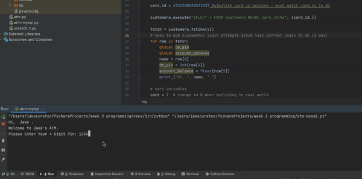

# ATM - Cash Machine
A fun little cash machine experiment. Started off in terminal and then attached an rpi4 to a matrix keypad and shazam, the code continues to grow.

## LOCAL ONLY
- Use [ATM.py](https://github.com/JakeCureton/Uni/blob/main/ATM.py) in pycharm or terminal. No dependancies needed.
Default pin is '1234' or 'bypass!' for more money. All money resets on re-run as no local db is setup.

## MySQL 
- Use [atm-mysql.py](https://github.com/JakeCureton/Uni/blob/main/atm-mysql.py) in pycharm and ensure to install package needed:

Preferences > Project > + > Search mysql-connector-python

or in command prompt run: 

`pip3 install mysql-connector`

- You also need a local [MySQL server](https://dev.mysql.com/downloads/mysql/). 

- Once installed, use a database tool such as [HeidiSql](https://www.heidisql.com/download.php) to connect to your MySQL server with root password you setup. 

- Download [customers.sql](https://github.com/JakeCureton/Uni/blob/main/customers.sql) from this git and import into your server using HeidiSql.

- Create a new user and set it priviledges for atm database.

- Change the variables in atm-mysql.py line 11 onwards to match your database connection and user credentials.

Default pin is 1234.

### SQL EVENT RESET WITHDRAW AMOUNT DAILY: 
- Execute the commands below with root db privileges in HeidiSQL.

`SET GLOBAL event_scheduler = ON;`

`CREATE EVENT withdraw_reset
ON SCHEDULE EVERY 1 DAY
STARTS '2020-01-21 00:00:00.000'
ON COMPLETION NOT PRESERVE
ENABLE
DO UPDATE atm.customers SET last_withdraw = '0'`

