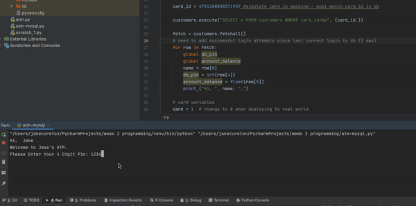

# Uni
A fun little cash machine experiment. Started off in terminal and then attached an rpi4 to a matrix keypad and shazam, the code continues to grow.

## LOCAL
use ATM.py in pycharm or terminal. No dependancies needed.
default pin is 1234 or bypass! for more money.

## MySQL 
use atm-mysql.py in pycharm and ensure to install package needed.
Preferences > Project > + > search mysql-connector-python

You also need a local MySQL server "https://dev.mysql.com/downloads/mysql/". 

Once installed, use a database tool such as HeidiSql to connect and create a database. 

Download customers.sql from this git and import into your database using HeidiSql.

Change the variables in atm-mysql.py line 11 onwards to match your database connection.

Default pin is 1234

### SQL EVENT RESET WITHDRAW AMOUNT DAILY: 
execute the bottom command with root db privileges in HeidiSQL.

CREATE EVENT withdraw_reset
ON SCHEDULE EVERY 1 DAY
STARTS '2020-01-21 00:00:00.000'
ON COMPLETION NOT PRESERVE
ENABLE
DO UPDATE atm.customers SET last_withdraw = '0'

